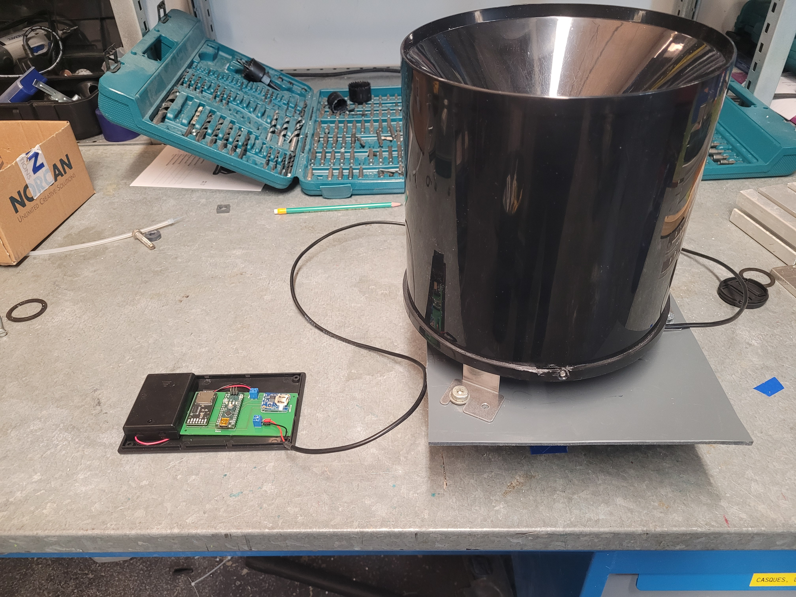
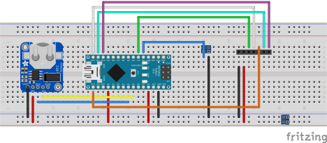
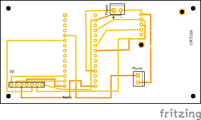

==================================================================
LoggerPluvio: Un pluviomètre autonome contrôlé par un Arduino Nano
==================================================================

Principe
=========

LoggerPluvio est un pluviomètre connecté à un datalogger autonome fonctionnant sur piles AA/AAA. Ses propriétés sont les suivantes

* Le pluviomètre fonctionne sur le principe des augets basculant. À chaque bascule un interrupteur ILS (dans mon cas GDKG PS-3150) se ferme et s'ouvre. 
* Le basculement provoque un réveil du Nano qui enregistre l'instant de la bascule sur une carte SD.
* l'enregistreur est contrôlé par un Arduino Nano, modifié dans le but de réduire la consommation d'énergie, tout en gardant l'instrument simple à manipuler et à programmer ;
* le temps est contrôlé par une horloge RTC1307 (toujours d'Adafruit)

Tous les composants sont soudés sur une carte PCB conçue avec Fritzing.
L'enregistreur est facile à construire (il fait partie d'un cours d'étudiant de premier cycle), facile à utiliser (il suffit de retirer la carte SD de temps en temps pour charger les données qui sont écrites sur un fichier texte ascii), et est indépendant de tout réseau et logiciel propriétaire.

Contrairement au LoggerMeteo il n'y a pas de fréquence d'échantillonnage, l'enregistrement à lieu dès qu'une bascule advient. 
La limite de détection est donc celle de l'horloge RTC c'est à dire 1 seconde. Ce n'est pas un problème cependant car 1 seconde correspond à la fréquence à laquelle l'entonnoir du pluviomètre s'engorge c'est à dire qu'il que de l'eau s'accumule dans l'entonnoir. Cette limite correspond à une précipitation de près de 720 mm/h que nous avons peu de chance d'atteindre même sous les tropiques.
Enfin le pluviomètre fonctionne normalement plus de cinq mois avec 3 piles AAA ou 11 mois avec 3 piles AA. Il est destiné à être déployé dans des endroits où la connexion est absente ou hasardeuse.

Coût
====
Le coût est donné pour les composants que j'utilise. Ils sont indicatifs et peuvent varier en fonction du fournisseur.

.. list-table:: 
  :header-rows: 1

  * - Composant
    - Prix (€ TTC)
  * - Arduino Nano
    - 25.90
  * - DS1307 RTC Clock (Ada 3296)
    - 9.8
  * - lecteur de cartes uPesy SD
    - 7.20
  * - Coupleur de piles
    - 2.00
  * - Carte PCB
    - 5.00
  * - Carte SD  (8Go)
    - 9.5
  * - Piles
    - 2.0
  * - Pluviomètre à auget 
    - 40 (Aliexpress)
  * - **Total**
    - **101.4**

Liens
=====

* https://morpho.ipgp.fr/metivier/public/ScEd/build/html/Datalogger.html
* https://morpho.ipgp.fr/metivier/public/Howto/build/html/Arduino.html
* Pour une discussion sur la pluie voire 
   
  * cette ancienne station météo https://github.com/fmetivier/MeteoProject_V2
  * cette discussion https://morpho.ipgp.fr/metivier/public/ScEd/build/html/Meteo.html 
  

Images
======

Dispositif avec Piles AAA
-------------------------

Breadboard 
----------

Le lecteur de carte est figuré par les emplacements des headers. Idem pour le BME680. Le BME est vissé. 
Sa connection se fait en soudant les quatres fils de la connexion I2C ce qui permet, si d'aventure le capteur lache, de le changer facilement.

Fritzing
--------

